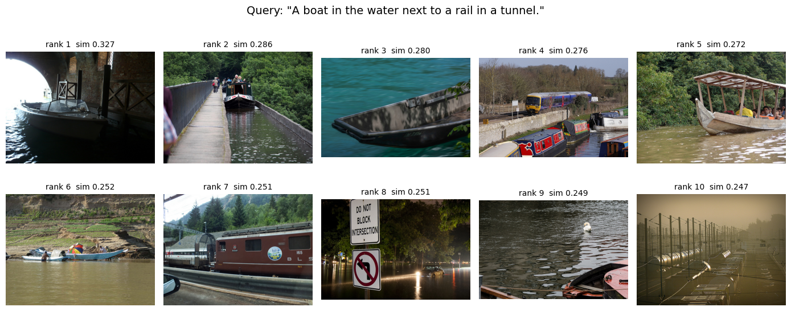
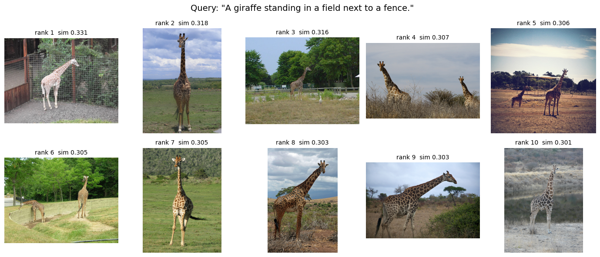
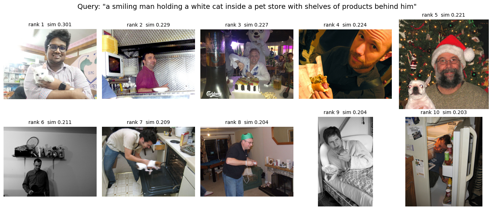
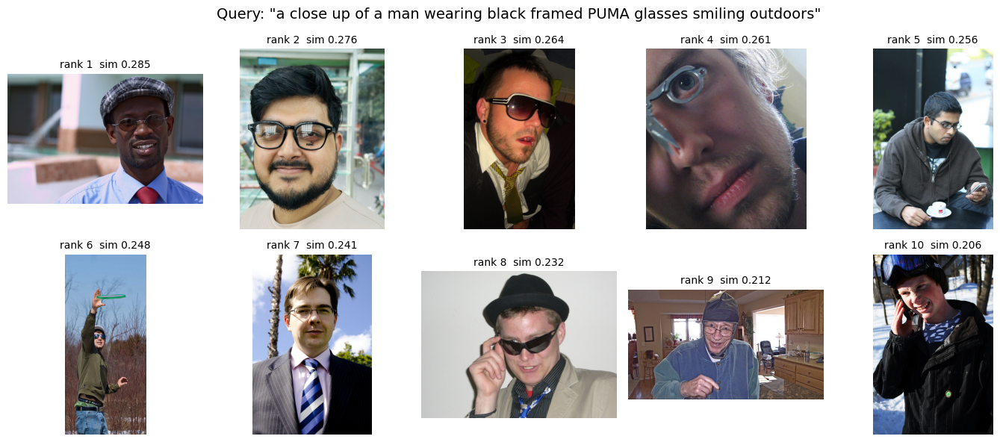
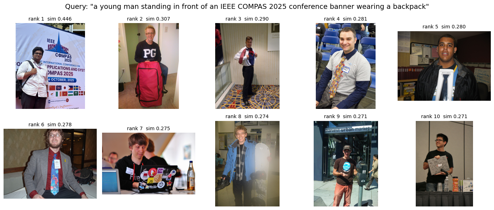

# Dual-Encoder Based Natural Image Search Engine (MS-COCO + Phone Images)

This repository contains the code and report assets for a **dual-encoder natural image search engine** built on top of **OpenCLIP ViT-B/32**.  
The system retrieves images from a large collection using **free-form captions** and is evaluated on:

1. **TestSet-1:** Images and captions from the **MS-COCO 2017** dataset  
2. **TestSet-2:** **Phone-captured images** taken by the author with manually written captions  

The goal is to understand **how well a pretrained dual-encoder model generalizes** from a curated benchmark dataset to real-world personal imagery and how performance changes as the search space scales from 5k to 118k+ images.

---

## 📘 Code & Resources

- **Colab Notebook (full implementation):**  
  👉 [Dual Encoder Image Search Engine Colab](https://colab.research.google.com/drive/12QB3Xjmi5JjgYaV6OGQ0QvG-Wv54VcE-?usp=sharing)

- **Dataset (MS-COCO 2017 on Kaggle):**  
  👉 [COCO 2017 Dataset on Kaggle](https://www.kaggle.com/datasets/awsaf49/coco-2017-dataset)

The notebook includes:

- OpenCLIP ViT-B/32 setup  
- Embedding generation for images and captions  
- FAISS indexing (cosine similarity)  
- Retrieval evaluation (Recall@K, MedR, MRR)  
- Visualization of top-K retrieved images for different queries  

---

## 🧠 Task Overview

Assignment requirements:

1. **Implement** a dual-encoder based natural image search engine using **MS-COCO**.  
2. **Prepare two test sets:**
   - **TestSet-1:** Images and captions drawn from MS-COCO 2017  
   - **TestSet-2:** Images captured by mobile phone + manually written captions  
3. **Compare** retrieval performance between **TestSet-1** and **TestSet-2**.

This repository provides exactly that: a CLIP-style dual encoder, a FAISS index over COCO images, and evaluation of phone-captured images under the same pipeline.

---

## 📦 Datasets

### TestSet-1 — MS-COCO 2017

Two COCO subsets are used:

- **Validation split**
  - **5,000 images**
  - **25,014 captions**
  - Clean, well-aligned human-written descriptions
- **Training split**
  - ~**118,000 images**
  - ~**590,000 captions**
  - Much larger, more redundant, and more noisy

All COCO images are processed through the **OpenCLIP image encoder**, and all captions through the **OpenCLIP text encoder**, producing L2-normalized 512-D embeddings stored in a **FAISS index**.

Example entries (validation split):

| ID    | File              | Caption                                                         |
|-------|-------------------|-----------------------------------------------------------------|
| 179765| 000000179765.jpg  | A black Honda motorcycle parked in front of a house            |
| 190236| 000000190236.jpg  | An office cubicle with four different types of workspaces      |
| 331352| 000000331352.jpg  | A small closed toilet in a cramped space                       |
| 517069| 000000517069.jpg  | Two women waiting at a bench next to a street                  |
| 182417| 000000182417.jpg  | A beautiful dessert waiting to be shared by two people         |

### TestSet-2 — Phone-Captured Images

TestSet-2 simulates a realistic usage scenario with **non-curated, real-life photos**.  
The author captured a small set of mobile-phone images and wrote captions manually.

#### Sample Phone Images and Captions

<p align="center">
  
  
  
</p>

- **Image 1:** “a young man standing in front of an IEEE conference banner wearing a backpack”  
- **Image 2:** “a smiling man holding a white cat inside a pet store with shelves of products behind him”  
- **Image 3:** “a close up of a man wearing black framed PUMA glasses smiling outdoors”

Due to strict path validation, **4 phone images** were used in the final evaluation.  
They are encoded with the same OpenCLIP pipeline and inserted into the FAISS index so that COCO and phone images live in the **same embedding space**.

---

## 🏗️ Model & Retrieval Pipeline

### Dual-Encoder (OpenCLIP ViT-B/32)

- **Image encoder:** Vision Transformer (ViT-B/32)  
- **Text encoder:** Transformer-based text model paired with the ViT  
- Both map inputs into a **shared 512-D embedding space**

#### Embedding Generation

- **Images**
  - Resize & center-crop to CLIP resolution
  - Normalize with CLIP mean/std
  - Encode with image encoder → 512-D vector
- **Captions**
  - Tokenize with OpenCLIP tokenizer
  - Encode with text encoder → 512-D vector
- **Normalize**: L2 normalization for both image and text embeddings

### FAISS Indexing

- Index type: **exact cosine-similarity** search  
- For a caption embedding \(x_t\) and image embedding \(x_i\):

\[
s(x_t, x_i) = \frac{x_t \cdot x_i}{\|x_t\|_2 \|x_i\|_2}
\]

Retrieval = compute caption embedding → query FAISS → return **top-K nearest images**.

---

## 🔍 Evaluation Metrics

For each caption query we compute:

- **Recall@K (R@1, R@5, R@10)** – fraction of queries where the correct image is in top-K  
- **Median Rank (MedR)** – median rank of the correct image  
- **Mean Reciprocal Rank (MRR)** – average of \(1 / \text{rank}\)

Metrics are reported separately for:

- **TestSet-1** (COCO validation and COCO training split)
- **TestSet-2** (phone images)

---

## 📈 Quantitative Results

### COCO Validation vs Phone Images

Using the **COCO 2017 validation split** (5k images) as the search index:

| Set   | R@1  | R@5  | R@10 | MedR | MRR   | N (queries) |
|-------|------|------|------|------|-------|-------------|
| COCO  | 0.388| 0.648| 0.747| 2    | 0.509 | 25,014      |
| Phone | 0.250| 0.500| 0.500| 11   | 0.388 | 4           |

- On **COCO** (clean, in-distribution), the engine is strong: correct image typically appears in **top-2**.
- On **phone images**, performance drops noticeably due to **domain shift**.

### COCO Training Split vs Phone Images (Large-Scale Retrieval)

Using the **COCO 2017 training split** (~118k images, ~590k captions):

| Set   | R@1  | R@5  | R@10 | MedR | MRR   | N (queries) |
|-------|------|------|------|------|-------|-------------|
| COCO  | 0.130| 0.267| 0.342| 36   | 0.202 | 590,313     |
| Phone | 0.250| 0.250| 0.250| 281  | 0.273 | 4           |

- **Scale hurts**: with 118k images, R@1 drops to ~13% and MedR rises to 36.
- Caption redundancy and many near-duplicate images make ranking harder.
- Phone images remain challenging; ranks fluctuate with very high MedR.

---

## 🖼️ Qualitative Examples

### 1. COCO Text→Image Retrieval

**Boat in tunnel**

<p align="center">
  
</p>

Query:  
> *“A boat in the water next to a rail in a tunnel.”*

**Giraffe next to fence**

<p align="center">
  
</p>

Query:  
> *“A giraffe standing in a field next to a fence.”*

Each montage shows the **top-10 retrieved COCO images**, with rank and cosine similarity printed above each tile.

---

### 2. Phone Captions Searching Over COCO

These experiments use **phone-written captions** as queries while searching **only across MS-COCO images**.

<p align="center">
  
</p>

- **Query:** “a smiling man holding a white cat inside a pet store with shelves of products behind him”  
- The rank-1 image is the author’s own phone image when it is included in the index; over COCO-only, visually similar scenes are retrieved (man + cat + indoor shelves).

<p align="center">
  
</p>

- **Query:** “a close up of a man wearing black framed PUMA glasses smiling outdoors”  

<p align="center">
  
</p>

- **Query:** “a young man standing in front of an IEEE COMPAS 2025 conference banner wearing a backpack”

These grids illustrate that the dual-encoder engine captures **broad semantics** (man, glasses, cat, banner-like background), but often struggles to retrieve the **exact** phone image when competing with thousands of similar COCO photos.

---

## 💭 Discussion & Takeaways

- Dual-encoder models like **OpenCLIP** excel on **curated, in-domain data** (COCO validation).  
- Retrieval quality deteriorates with:
  - **Scale** (5k → 118k+ images)
  - **Caption redundancy/noise** in the training split  
  - **Domain shift** from web/COCO images to personal phone photos  

Even when the model understands high-level semantics, it may still:

- Confuse visually similar scenes,
- Miss identity-level details (same person, same store),
- And show high rank variance when the query domain is far from pretraining.

For **real-world deployment**, these results highlight the need for:

- **Domain-aligned fine-tuning** on user or application-specific images,
- Possibly hybrid systems combining CLIP-style retrieval with re-ranking or metadata filters.

---

## 👤 Author

**Akif Islam**  
Department of Computer Science & Engineering  
University of Rajshahi, Bangladesh  
📧 `iamakifislam@gmail.com`

---

## 📚 Citation

If you use this repository, any code snippet, or take help from the explanations, **please cite**:

```bibtex
@misc{ameen2025detectingaigeneratedimagesdiffusion,
      title={Detecting AI-Generated Images via Diffusion Snap-Back Reconstruction: A Forensic Approach}, 
      author={Mohd Ruhul Ameen and Akif Islam},
      year={2025},
      eprint={2511.00352},
      archivePrefix={arXiv},
      primaryClass={cs.CV},
      url={https://arxiv.org/abs/2511.00352}, 
}
